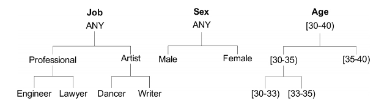

# Personal Data Minimization:

## Introduction:
This document presents basic concepts and hands on exercises to practice foundations of personal data minimization.

## Basic Concepts:

### Data Anonymization: 
Data anonymization (also known as de-identification or data minimization) is a technique to be applied on datasets containing personal information in which sensitive information about individuals are stored. The main objective of anonymization is to weaken the link between the datasets' personal information and individuals. Anonymized data means that data which previously addressing individuals is processed and after the process the probability of uniquely identifying these individuals becomes less. 


### Fundamental Technqies:

#### Generalization: 
Data generalization is a simple technique by which an exact value of a sensitive attribute is replaced with a more general value. In order to choose a general value, a *taxonomy tree* is built by a (data) domain expert. The exact values must be found among the leaves. The most general value appears in the root.  

<!--
Examples of taxonomy trees: 
-->

#### Suppression:
Suppression is used to obliterate values that are identifying individuals. One common example could be replacing values of social security numbers with ' * '.

#### Partial Suppression:
One may generalise a set of values using partial suppression (masking). In partial suppression, the original value is suppressed in different levels which results in a hierarchy of values.

Examples:

| zip code 0 | zip code 1 | zip code 2 | zip code 3 |
|---|---|---|---|
| 22345 | 2234* | 223** | 22*** |
| 22014 | 2201* | 220** | 22*** |
| 21338 | 2133* | 213** | 21*** |


### Fundamental Algorithms:

#### [k-anonimity](https://dataprivacylab.org/dataprivacy/projects/kanonymity/kanonymity.pdf):

The main focus of this algorithm is QIDs. Using taxonomy trees, the algorithm builds a class of records with equal values for *qids*. After applying k-anonymity, if one record in the table has some value *qid*, at least *k* − 1 other records also have the value *qid*. In other words, the minimum group size on *QID* is at least *k*. A table satisfying this requirement is called *k-anonymous*. In a *k*-anonymous table, each record is indistinguishable from at least *k* − 1 other records with respect to *QID*. Consequently, the probability of linking a victim to a specific record through *QID* is at most 1/*k*.

#### [l-diversity](https://personal.utdallas.edu/~mxk055100/courses/privacy08f_files/ldiversity.pdf):

This algorithm focuses on sensitive (confidential) attributes. After applying *k-anonymity*, the dataset can be viewed as a set of *k-anonymous groups* (equivalence classes). The goal is to have at least *l distinct values* for each sensitive attribute within equivalence classes.

#### [t-closeness](https://www.cs.purdue.edu/homes/ninghui/papers/t_closeness_icde07.pdf):

An equivalence class is said to have *t-closeness* if the distance between the distribution of a sensitive attribute in this class and the distribution of the attribute in the whole table is no more than a treshold *t*. A table is said to have *t-closeness* if all equivalence classes have *t-closeness*.

## Exercises:

<!--
### Part Zero :
1. Make a anonymisation-pseudonymisation plan. This should include the following information: 
creator(s) of the plan, person(s) carrying out the anonymisation, features in the data that have an impact on anonymisation, assessment of the disclosure risk of respondents' personal data, anonymisation techniques used along with the rationale for using them. You can use this template which [can be found here](https://www.fsd.tuni.fi/en/services/data-management-guidelines/anf-template.pdf)
-->

### Manual:

#### Linking Tables:
Assume two following data sets ([reference](https://dl.acm.org/doi/10.5555/1858974.1858983)):

| id | Name | Address | Zip Code | Sex | Year of birth | PV# | PV Date |
|---|---|---|---|---|---|---|---|
| 1 | Paelix | Schmidtweg 4 | 1321JE | M | 1975 | 1234-01 | 6-Jun-2001 |
| 2 | Jans | Wagenstraat 9 | 1212ZK | F | 1960 | 3453-97 | 1-May-1997 |

**Table 0: Small (raw) crime data set-View 1**

| id | Name | Address | City | Sex | Date of birth | Case# | Crime type | Crime date |
|---|---|---|---|---|---|---|---|---|
| 3 | Paelix | Schmidtweg 4 | Almere | M | 4-May-1975 | 2535-01 | 1 | 5-6-2001 |
| 3 | Paelix | Schmidtweg 4 | Almere | M | 4-May-1975 | 2535-01 | 2 | 6-6-2001 |
| 4 | Burg | Knuthstraat 48 | Tiel | F | 6-Oct-1975 | 2342-01 | 1 | 6-6-2001 |

**Table 1: Small (raw) crime data set-View 2**

1. EIDs (Explicit IDentifiers): Which attributes are candidates for explicit identifier? Suppress EIDs of **Table 1** and transform to a new table **Table 1-1**. How can an intruder link subjects from **Table 0** to **Table 1-1**?

#### Taxonomy tree:

##### Data Set: 
Consider this small data set below in the following exercises.

| SSNumber | Age | ZipCode | Condition |
|---|---|---|---|
| 1234-12-1234 | 21 | 23058 | heart disease |
| 2345-23-2345 | 24 | 23059 | heart disease |
| 3456-34-3456 | 26 | 23060 | viral infection | 
| 4567-45-4567 | 27 | 23061 | viral infection | 
| 9012-90-9012 | 32 | 23058 | kidney stone | 
| 0123-12-0123 | 34 | 23059 | kidney stone | 
| 4321-43-4321 | 35 | 23060 | aids | 
| 5432-54-5432 | 38 | 23061 | aids | 
| 5678-56-5678 | 43 | 23058 | kidney stone | 
| 6789-67-6789 | 43 | 23059 | heart disease | 
| 7890-78-7890 | 47 | 23060 | viral infection | 
| 8901-89-8901 | 49 | 23061 | viral infection | 

**Table 2: Small (raw) disease data set.**


1. Taxonomy Tree: Assume an attribute **Job** with the following values:
```Job={Software Developer,Writer,Civil Engineer,Lawyer,Dancer,Graphist,Journalist}```
Propose a taxonomy tree for **Job**.

2. QIDs (Quasi IDentifiers): Which attributes in **Table 2** can be candidates for QIDs?

3. Taxonomy Tree: Using **Table 2**
	- Apply partial suppression and define a taxonomy tree for **Age**.
	- Using intervals for **Age** define a taxonomy tree in 4 levels. Lowest level, i.e. **Age_0** will be the values in the data set.

4. Taxonomy Tree: Using **Table 2** define a taxonomy tree for **ZipCode**.
5. Store your taxonomy trees of **Table 2** in separate csv files. 


#### k-anonymity:

1. 2-anonymity of **Table 2**: For the moment assume **Condition** as a non-sensitive attribute. Use your taxonomy trees and try to transform  (*ad-hoc*) the original data set to a minimized data set where it satistifies *2-anonymity*.
	- What are the main challenges in building a k-anonymous table?
	- Is there only one solution or more?

2. 4-anonymity of **Table 2**: For the moment assume **Condition** as a non-sensitive attribute. Use your taxonomy trees and try to transform  (*ad-hoc*) the original data set to a minimized data set where it satistifies *4-anonymity* (*ad-hoc*).
	- What are the main challenges in building a k-anonymous table?
	- Is there only one solution or more?

3. Optimum Solution: Applying k-anonymity of **Table 2**, in case you have found more solutions for your transformed data set, which one would you prefer as an *optimum solution*? why?

4. (Optional) K-anonymity: Apply 4-anonymity (*ad-hoc*) on this dataset: [a simple dataset is available here](./datasets/ds_med_01.csv).


#### l-diversity:

1. 2-Diversity of **Table 2**: **Condition** is a sensitive attriubte. Transform your *4-anonymity* solution to a new data set where it satisfies *2-diversity*.

#### t-closeness:

| | zip code | age | salary | disease |
|---|---|---|---|---|
| 1 | 47677 | 29 | 3K | gastric ulcer |
| 2 | 47602 | 22 | 4K | gastritis |
| 3 | 47678 | 27 | 5K | stomach cancer |
| 4 | 47905 | 43 | 6K | gastritis |
| 5 | 47909 | 52 | 11K | flu |
| 6 | 47906 | 47 | 8K | bronchitis |
| 7 | 47605 | 30 | 7K | bronchitis |
| 8 | 47673 | 36 | 9K | pneumonia |
| 9 | 47607 | 32 | 10K| stomach cancer |

**Table 3: Salary/Disease raw data.**

| | zip code | age | salary | disease |
|---|---|---|---|---|
| 1 | 476** | 2* | 3K | gastric ulcer |
| 2 | 476** | 2* | 4K | gastritis |
| 3 | 476** | 2* | 5K | stomach cancer |
| 4 | 4790* | >=40 | 6K | gastritis |
| 5 | 4790* | >=40 | 11K | flu |
| 6 | 4790* | >=40 | 8K | bronchitis |
| 7 | 476** | 3* | 7K | bronchitis |
| 8 | 476** | 3* | 9K | pneumonia |
| 9 | 476** | 3* | 10K| stomach cancer |

**Table 4: A 3-diverse version of Salary/Disease.**

1. Analyze **Table 4**. Is it 3-anonymouse? Is it 3-diverse? What are the ECs (equivalnce classes)? 
2. Assume you have some background information about an individual and you know that released (**Table 4**) contains the information of the invidual. Try to see what information you can gain from **Table 4**?
*Hint:* Draw one axis with a range of numbers between 1(K) and 11(K). Assign a separate symbol for each EC (for example $\times$ for EC1, $\circ$ for EC2 and $\Delta$ for EC3) and put the symbols on the axis (corresponding to each salary). What do you recognise?
3. How would you fix the problem you recognised in the previous exercise? Propose a new table which does not have this issue. 
*Hint:* You may need to change the generalisations.


### Tools:

To carry the exercises of this part, you can use our small medical data set (**Table 2**) or a (larger) fake data set [available here](./datasets/dataset-fake-2021/)

1. ARX: Download and install ARX [Check here: https://arx.deidentifier.org/](https://arx.deidentifier.org/) 
2. Taxonomies as CSVs: Prepare your taxonomy trees (for example **Age** and **ZipCode** from **Table 2**) in CSV formats.
3. ARX: Watch provided tutorial video to explore basic steps of ARX and try to anonymize our data sets: 4-anonymity and 2-diversity.

<!--
4. ARXaaS: Using ARXaaS [Check here](http://145.24.222.216:3000/) and try to anonymize our data set: 4-anonymity and 2-diversity. 
**Important**: Do not use this link for sensitive information. This link is provided only for educational purpose.
-->

# Resources:

## Books

1. Book: ["Database Anonymization: Privacy Models, Data Utility, and Microaggregation-based Inter-model Connections"](https://www.researchgate.net/publication/290229262_Database_Anonymization_Privacy_Models_Data_Utility_and_Microaggregation-based_Inter-model_Connections)

## Survey

1. Privacy-preserving data publishing: A survey of recent development [[download here](https://dl-acm-org.ezproxy.hro.nl/doi/10.1145/1749603.1749605)]

## Tool

1. Tool: [ARX as an anonymization tool and API](https://arx.deidentifier.org/)
2. Tool: [ARX as a Service](https://oslomet-arx-as-a-service.github.io/resources/Product_Specification.pdf)

### Report

1. A bachelor thesis: [Anonymization of health data](https://www.duo.uio.no/bitstream/handle/10852/79902/Anonymization-of-Health-Data.pdf?sequence=13&isAllowed=y)


<!--
### misc

1. Fundamentals in data anonymization. [Read here](https://www.dataversity.net/the-fundamentals-of-data-anonymization-and-protection/#)
2. Is it still possible to identify anonymized data? [Read here](https://www.nytimes.com/2019/07/23/health/data-privacy-protection.html)
-->

