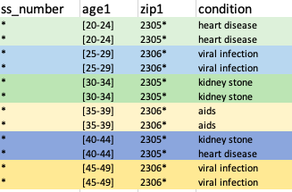
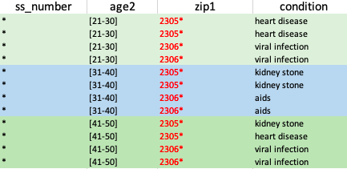
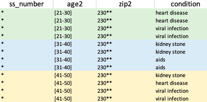
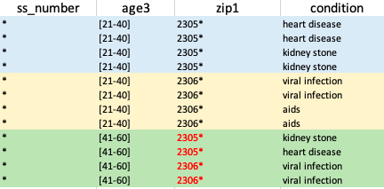
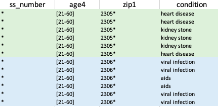

## Introduction:
This document collects simple exercises to practice Data Anonymization.


## Data Set: 
Consider the data set below in the following exercises.

| SSNumber | Age | ZipCode | Condition |
|---|---|---|---|
| 1234-12-1234 | 21 | 23058 | heart disease |
| 2345-23-2345 | 24 | 23059 | heart disease |
| 3456-34-3456 | 26 | 23060 | viral infection | 
| 4567-45-4567 | 27 | 23061 | viral infection | 
| 9012-90-9012 | 32 | 23058 | kidney stone | 
| 0123-12-0123 | 34 | 23059 | kidney stone | 
| 4321-43-4321 | 35 | 23060 | aids | 
| 5432-54-5432 | 38 | 23061 | aids | 
| 5678-56-5678 | 43 | 23058 | kidney stone | 
| 6789-67-6789 | 43 | 23059 | heart disease | 
| 7890-78-7890 | 47 | 23060 | viral infection | 
| 8901-89-8901 | 49 | 23061 | viral infection | 

### Exercises:

1. EIDs (Explicit IDentifiers): Which attribute is an explicit identifier? Transform the original data set to a new data set where it protects re-identifying individuals regardin EIDs.

*Solution*: **SSNumber** is an EID. Suppresing the values of **SSNumber** or removing the column can be possible solutions.

2. QIDs (Quasi IDentifiers): Which attributes can be candidates for QIDs?

*Solution*: **Age** and **ZipCode**.

3. Taxonomy Tree: Define a taxonomy tree for **Age** in 4 levels. Lowest level, i.e. **Age_0** will be the values in the data set.

*Solution*: This is one possble taxonomy tree. Consult your solution with the teacher. [The taxonomy tree as a csv file can be found here](./datasets/small-dataset-medical/tax_age.csv)

4. Taxonomy Tree: Define a taxonomy tree for **ZipCode**.

*Solution*: [The taxonomy tree as a csv file can be found here](./datasets/small-dataset-medical/tax_zip.csv)

5. Taxonomy Tree: Assume an attribute **Job** with the following values:
```Job={Software Developer,Writer,Civil Engineer,Lawyer,Dancer,Graphist,Journalist}```
Propose a taxonomy tree for **Job**.

*Solution*: No solution, should be straightforward. 

6. 2-anonymity: For the moment assume **Condition** as a non-sensitive attribute. Use your taxonomy trees and try to transform the original data set to a minimized data set where it satistifies *2-anonymity*.
	- Is there only one solution or more?

*Solution*: 
- Variation one of **Age** taxonomy tree: There is no solution 
[Check here](./datasets/small-dataset-medical/k2_anonym_age_tax_1.png)

- Variation two of **Age** taxonomy tree: There is a solution 


7. 4-anonymity: For the moment assume **Condition** as a non-sensitive attribute. Use your taxonomy trees and try to transform the original data set to a minimized data set where it satistifies *4-anonymity*.
	- Is there only one solution or more?

*Solution*: 

- **(Age2 , Zip1)** 

- **(Age2 , Zip2)** 

- **(Age3 , Zip1)** 

- **(Age4 , Zip1)** 


8. Optimum Solution: In case you have found more solutions for your transformed data set, which one would you prefer as an *optimum solution*?

*Solution*: Depends on our target in applying SDC technique: The balanace between *utility and risk*.

9. 2-Diversity: **Condition** is a sensitive attriubte. Transform your *4-anonymity* solution to a new data set where it it satisfies *2-diversity*.

*Solution*: Check which one of our 4-anonymity solutions are 2-diversity.

10. ARX: Download ans install ARX [Check here: https://arx.deidentifier.org/](https://arx.deidentifier.org/) 
11. Taxonomies as CSVs: Convert your taxonomy trees of **Age** and **ZipCode** to CSV formats.
12. ARX: Watch provided tutorial video to explore basic steps of ARX and try to anonymize our data set: 4-anonymity and 2-diversity.
13. ARXaaS: Using ARXaaS [Check here](http://145.24.222.216:3000/) and try to anonymize our data set: 4-anonymity and 2-diversity. 

