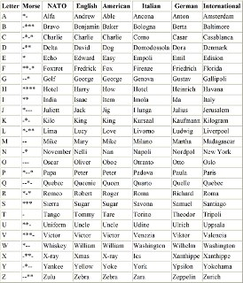

# PyCamp 04: Challenges

### Review:

1. [todo: add exercises suitable for reviewing weeks 01-03]

## Sprinters:

### Alfa Bravo Charlie

1. When communicating with a lot of noise on the line, some words (code from an airplane, for example) are spelled with whole words. Make a prototype that can do this. 

IN: TITANIC 
OUT: TANGO INDIA TANGO ALFA NOVEMBER INDIA CHARLY 

Slowly expands functionality:
 
| Release | Functie |
|----|----|
| 1 |  Spellen met NATO |
| 2 | Voeg English t/m International toe (Keuze gebruiker) | 
| 3 | Voeg Morse toe | 
| 4 | Maak ook een morse-decoder | 
| 5 * | Gebruik de speaker om morse te produceren |
| 6 *** | Gebruik spraaksynthese om te spellen met NATO (of met wav of mp3) |

 

 

 