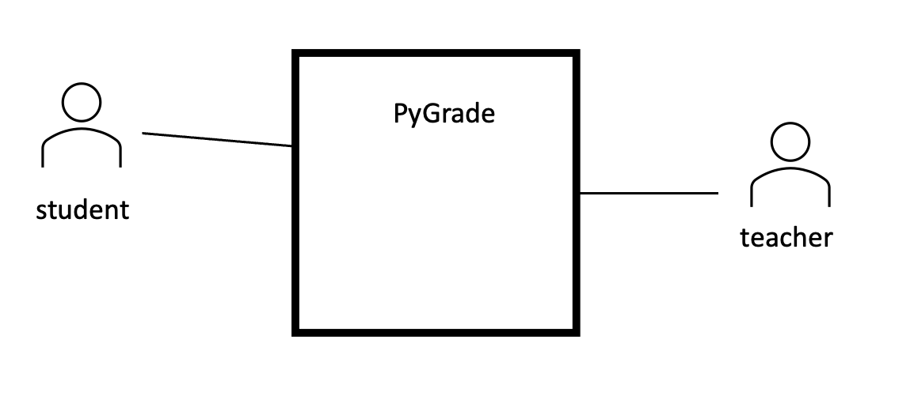
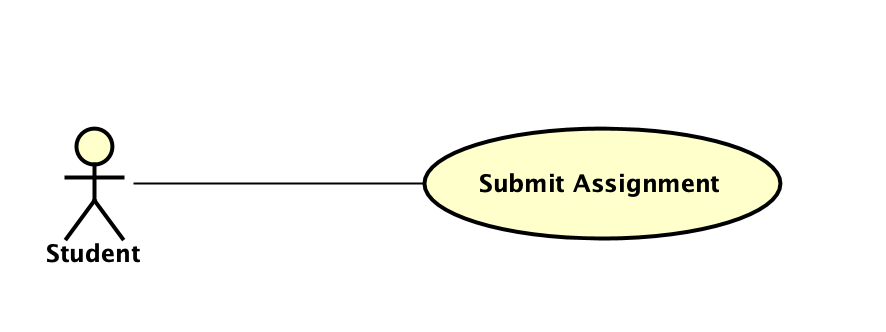
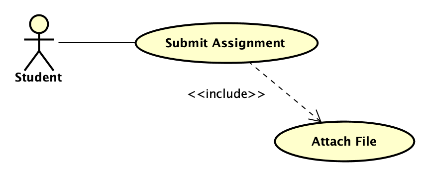

# Introduction

In requirements modeling with UML, use case diagrams serve as a powerful tool for capturing and visualizing the functional requirements of a system from the end user's perspective. Use cases represent specific interactions between users, known as actors, and the system itself, highlighting the various ways in which the system responds to external stimuli. Each use case encapsulates a specific functionality, depicting a coherent and meaningful set of interactions. Actors, representing entities external to the system, are connected to use cases through associations, illustrating the roles users play in the system. By employing use case diagrams, stakeholders gain a clear understanding of the system's expected behavior and functionalities, facilitating effective communication between designers, developers, and end users throughout the software development lifecycle. The workshop will guide participants in creating, analyzing, and interpreting use case diagrams to enhance their skills in requirements modeling for software systems.

## Project

Software projects usually start when someone has an idea and then they write it down in a proposal. The proposal begins by explaining what the system will do. This whole process, from idea to proposal, is really important because it sets the foundation for the project and helps everyone involved to make it successful. One of the main jobs of a requirements engineer is to give more details about the system, clear up any confusing parts, and help everyone understand it better.

In this workshop, we'll focus on writing a simple system description, figuring out what the software needs to do, and learning the basics of use case modeling. If you want to dive deeper into requirements engineering, you'll need to take a more thorough course because those topics are a bit more advanced.

### Proposal: PyGrade

**Idea:** PyGrade, a programming assignment grading system, offers streamlined functionalities for both students and teachers. Students can submit their Python programming assignments through the platform, receive timely feedback on their code, and access graded results. The system allows students to view detailed comments from teachers, aiding in understanding and improving their coding skills. On the teacher's end, PyGrade simplifies the grading process by providing an intuitive interface for reviewing and evaluating student submissions. Teachers can assign grades, offer constructive feedback, and communicate with students regarding their performance. Additionally, PyGrade supports the management of assignment deadlines, helping teachers efficiently organize and administer programming assessments. Overall, PyGrade enhances the grading experience for both students and teachers, fostering effective communication and improving the learning outcomes of programming courses.

**Activity** Let's without having any knowledge and exprience of Use Case diagrams, sketch the interactions between PyGrade and its environment. More likely, the sketch will be similar to the picture below. Specify and write down three main functionalities of PyGrade.

### Scenarios:

In software development, a scenario is a narrative description of how a particular feature or system function will be used in real-world situations. It serves as a valuable tool for understanding the practical application of the software, helping to envision user interactions and system responses. To create effective scenarios, the first crucial step is discovering the main users or actors involved in the system. Identifying these key users lays the groundwork for crafting scenarios that capture their unique perspectives, needs, and interactions with the software, ensuring that the developed system aligns closely with user expectations and requirements. Essentially, user discovery is the initial building block for constructing meaningful and user-centric scenarios in the software development process. 

Suppose a requirement engineer, after some interviews and inspections has formulated the following two scenarios:

#### Student
""As a student named Alice, I imagine an easy-to-use system for submitting assignments and getting feedback. In this system, I want to log in and easily find the 'Submit Assignment' button. When submitting an assignment, I'd like to attach my code files and documents effortlessly. It would be great if the system can check for plagiarism in real-time, giving me instant feedback.

After submitting, I wish to receive notifications for deadlines and when my feedback is ready. In the system, I also want a straightforward way to see my graded results and the feedback my instructor provided. This simple and user-friendly system would make it easy for me to submit assignments, stay updated, and understand how I'm doing in my courses.""

#### Teacher
"As Professor Smith, I envision an innovative grading system that caters to my needs as an instructor. In this desired system, upon logging in, I wish to seamlessly navigate to the 'Grading Submissions' section. Once there, I anticipate the ability to review assignments with ease, gaining access to detailed submission details, including code files and additional documents attached by students. As I grade assignments, I express a strong desire for a concurrent plagiarism check feature running in the background. This envisioned system would empower me to provide prompt feedback and address any potential plagiarism concerns immediately. Additionally, I desire a streamlined communication feature that facilitates interaction with students regarding feedback or plagiarism issues. This desired system would revolutionize the grading process, providing efficiency, integrity, and effective communication channels for instructors like myself."

Reading the scenarios, we will practice recongnising some functionalities of PyGrade.

#### Interactions

##### Student:

1. Assignment Submission: Students use PyGrade to submit their programming assignments, uploading their code and related files through a straightforward interface.
2. Feedback Access: After submission, students log in to PyGrade to access timely feedback from teachers, viewing comments and suggestions to understand their coding strengths and areas for improvement.
3. Graded Results: PyGrade allows students to check their graded results, displaying assigned grades and detailed feedback, fostering a transparent and informative grading process.
Teacher Scenario:

##### Teacher:

1. Assignment Review: Teachers log in to PyGrade to review and evaluate student submissions, using the platform to assess the code's quality and correctness.
2. Grading: PyGrade simplifies the grading process for teachers, providing an intuitive interface to assign grades and offer constructive comments, ensuring efficient and consistent evaluation.
3. Communication: Teachers utilize PyGrade to communicate with students, providing clarifications on feedback, answering queries, and facilitating effective interaction to support student learning.

**Activity** Using scenarios and stories of interactions, one can extract functionality of the system. Reading the scenarios of PyGrade, we realise "Submit Assignment" is one of the main functionalities. Extract and write down at least three more functionalities of PyGrade. 

### Modeling

To make it easier to grasp the scenarios and manage the complexity (of a bigger system), we can use visual representation of PyGrade like use case diagrams. Imagine a "Student" as the main actor. What would be the main functionality desireable to a "Student"? Let's focus on: "Submit Assignment." In a use case diagram, you'd represent the "Student" as a stick figure. What is a visual notation for a use case? In order to specify how "Student" is benefiting from PyGrade, we connect the actor, i.e. "Student" to the "Submit Assignment" use case with a line named "association". This visual representation instantly conveys that the student is interacting with the system by submitting their assignments. Use case diagrams simplify complex textual scenarios into easy-to-understand visuals, making it clearer for stakeholders and development team to visualize how different parts of the system connect and how users, like the student, actively engage with the software.

**Activity** You have discovered more functionalities of PyGrade. Moreover, we know there is one more actor using PyGrade. Who (What) is the other actor? Complete Use Case Diagram with new use cases associated with correct actors. Hint: First write down scenarios of some of the functionalities that are important to model.

### Inclusion

One can elaboarte more details in a use case diagram. Use cases can be broken into smaller pieces. In this way we say one use case includes the other use case. The relashipship between two use cases is a **dependency** labeled as *<< include >>*. 

In simple terms, the "include" relationship in use cases is like putting smaller puzzles into a bigger one. Imagine you have a big use case, like "Ordering Food." Inside that, you might have smaller actions like "Selecting Items" and "Making Payment." The "include" relationship is like saying, "To order food, you must include the actions of selecting items and making payment." It helps break down the big picture into smaller, manageable parts, making it clear how different actions fit together to achieve the main goal. It's like building with building blocks – you include the smaller blocks to create the complete structure.

**Example**: Analysing this setence can reveal one smaller use case included in "Submit Assignment". 

**Students use PyGrade to submit their programming assignments, <ins>uploading their code and related files</ins> through ...**

Check how this is modeled in the following diagram:

**Activity** Read the provided scenarios again. Do you recognise smaller use cases (functionalities) included in already modeled use cases? Update your model.

